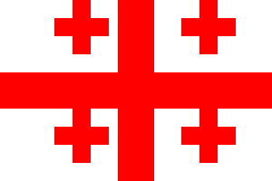

# Лабораторна робота №0

## Інформація про країну: **Грузія**

### Загальні дані

> Грузія — країна в Східній Європі, розташована на перетині Європи та Азії.

**Основна інформація:**
- **Площа:** *69,700 км²*  
- **Населення:** ~3.7 мільйона (станом на 2023 рік).  
- **Державний устрій:** **Унітарна парламентська республіка**.  
- **Столиця:** ***Тбілісі***.

---

### Видатні особистості

- **Шота Руставелі** — великий грузинський поет, автор епосу *"Витязь у тигровій шкурі"*.  
- **Зураб Церетелі** — сучасний художник і скульптор.

---

### Пам’ятки культури та природи

1. **Культурні пам'ятки:**
   - Собор Светіцховелі (Мцхета) — пам’ятка світової спадщини ЮНЕСКО.
   - Печерне місто Уплісцихе — стародавнє місто в скелі.
2. **Природні ландшафти:**
   - Кавказькі гори.
   - Національний парк Тушеті.

---

### Таблиця фактів

| **Факт**           | **Деталі**                          |
|--------------------|-------------------------------------|
| **Національна валюта** | Ларі                              |
| **Офіційна мова**      | Грузинська                       |
| **Клімат**             | Помірний                        |

---

### Прапор Грузії

---

### Картинка краєвиду

---

### Гіперпосилання

[Дізнайтеся більше про Грузію на Wikipedia](https://uk.wikipedia.org/wiki/Грузія)
